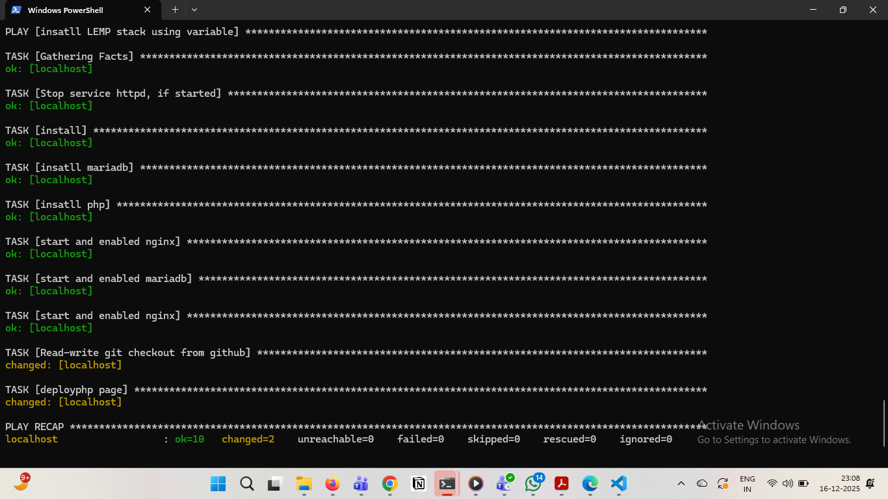
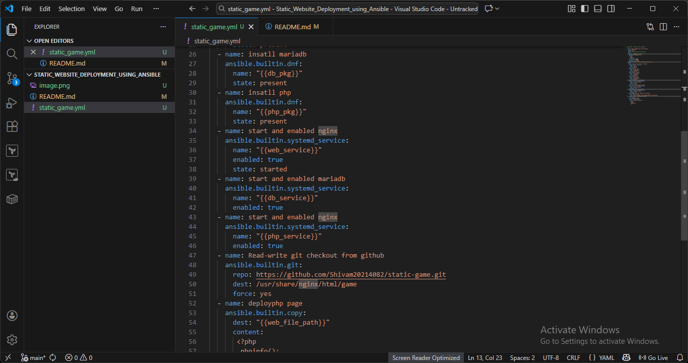

# Static Website Deployment using Ansible (Nginx)

## 📌 Project Overview

This project demonstrates how to deploy a **static website** on an EC2 instance using **Ansible automation** and **Nginx web server**. The website code is pulled from a GitHub repository and served via Nginx.

The deployment is fully automated using Ansible playbooks and variables, following DevOps best practices.

---

## 🛠 Tools & Technologies Used

* **AWS EC2** – Compute instance
* **Ansible** – Configuration management & automation
* **Nginx** – Web server
* **Git & GitHub** – Source code management
* **Linux (Amazon Linux / RHEL based)**

---

## 📂 Project Architecture

```
Local Machine (Ansible Controller)
        |
        | SSH
        v
EC2 Instance (Managed Node)
        |
        |-- Nginx Installed
        |-- Static Website Deployed
```

---

## 🚀 Deployment Steps

### Step 1: Launch EC2 Instance

* Launch an EC2 instance (Amazon Linux / RHEL)
* Allow inbound traffic on **port 80 (HTTP)**
* Configure SSH access

---

### Step 2: Install Ansible on Controller Node

```bash
sudo yum install ansible -y
```

---

### Step 3: Create Ansible Playbook

* Uses variables for package names and paths
* Installs Nginx
* Starts and enables Nginx service
* Clones static website from GitHub

---

### Step 4: Run Ansible Playbook

```bash
ansible-playbook deploy.yml
```

---


## ✅ Output

* Static website successfully deployed
* Website served using Nginx
* Fully automated using Ansible

---

## 🧠 Key Learnings

* Infrastructure automation using Ansible
* Using variables for reusable playbooks
* Deploying static content with Nginx
* Git-based application deployment

---

## 📌 Use Cases

* DevOps learning project
* Static website hosting
* Interview-ready automation example


# Screenshots





---

## 👤 Author

**Hrishikesh Khandagale**
DevOps | AWS | Ansible | Linux

---

